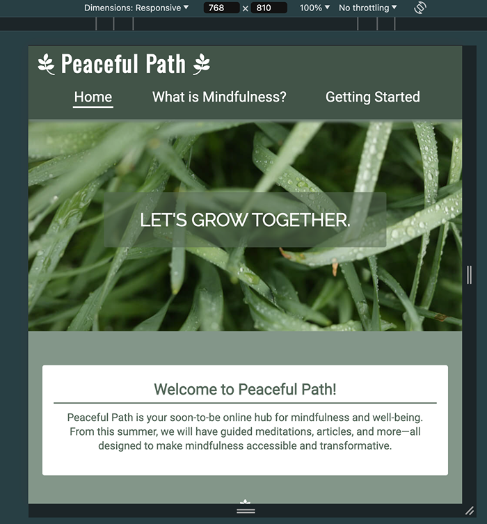

# **Peaceful Path**
The link to the live website: 
https://maevecrossan.github.io/peaceful-path/index.html 

## **Introduction**

Peaceful Path is a mindfulness website targeted towards those either starting or restarting their mindfulness journey. Its main purpose is to establish a relationship with its audience, promote its brand identity while finalising its services, provide essential information on mindfulness, and offer a free 30-day mindfulness guide. 

This project was built with HTML and CSS.

> **Note:** Please cmd-click (Mac) or ctrl-click(Windows) on any links to open them in a new tab.

## **UX**

### Target Audiences
* Students, young professionals, and working adults who would like to reduce stress levels and seek work-life balance. 
* Parents/ carers who would like to make more time for themselves and reduce stress. 
* Middle-aged and seniors who are facing a combination of career demands, family responsibilities, and potential health concerns, making mindfulness appealing for its holistic health benefits.
* Mindfulness techniques and culture are found globally, meaning the value of mindfulness is acknowledged widely and appeals to an expansive audience.

### User Stories
As a user...
* I want to learn more about the company.
* I want to learn about mindfulness and its benefits.
* I want to experience how this brand views mindfulness.
* I want the choice to be updated on future services that will become available. 
* I want to experience how the company teaches mindfulness through various media.

As a business...
* I want to establish a relationship with my audience.
* I want to promote my brand identity and ethos.
* I want to show an active interest in mindfulness by improving and growing our services.
* I want users to engage with the 30-day mindfulness challenge.
* I want to grow our customer base by encouraging users to sign up for updates.
* I want to create a small gallery of original content to further engage customers and display our services.

#### Opportunities
Below is a table of opportunities based on user stories with corresponding importance and viability/feasibility ratings. 

| Opportunities | Importance | Viability/Feasibility |
|-----|:-----:|:-----:|
| Learn more about the company | 5 | 5 |
| Learn about mindfulness and its benefits | 5 | 5 |
| Experience how this brand views mindfulness | 4 | 5 |
| Choice to be updated on future services | 3 | 5 |
| Experience how the company teaches mindfulness through various media | 3 | 1 |

I decided to omit the last opportunity as I knew more time would be needed to learn how to create a gallery through which to display images, videos, and audio. My main concern was ensuring that the media display matched the website's clean and simple design. Although it wasn't a priority for this project, I would have liked to include it if I had more time to learn, practice, and implement it properly.

### Wireframe Mockups
I used the Procreate app on my iPad to draw and map out the basic structure of each page. I chose this app because I'm very familiar with it, it provides complete creative freedom, and it allows for easy adjustments.

*Figure 1 - Mobile Outline: index.html & explanation.html*

*Figure 2 - Mobile Outline: signup.html & form-feedback.html*

*Figure 3 - Screens 768px and Above Outline: homepage*

 

>:memo: Note: Only this much of the larger screen mockup is drawn as the rest of the elements remain the same regardless of screen size.

## Features

### Common Features
#### Colour Palette
I used Procreate to create my colour scheme by pulling colours from the hero image. This helped me create a rough colour palette which I used for a large duration of the project. The original colours were modified towards the end of the project to improve accessibility.
The colours I used are as follows:

| Colour Names | Use |
|-----|:-----:|
| rgb (66, 84, 72) or #425448 | header and footer background |
| rgb (255, 255, 255) or #ffffff | header font, the footer font and the (alternating) body text/div backgrounds |
| rgb (110, 127, 115) or #6E7F73 | menu box-shadow |
| rgb (131, 150, 137) or #839689 | main background |
| rgb (85, 105, 91) or #55695B | (alternating) body text/div background |

#### The Logo

The logo remains in the top left corner of the header at all times, adjusting its size depending on the screen size. I added the branch decorations from Font Awesome to make the logo stand out, to add visual interest, create some space around the text, and emphasise the natural theme.

The logo also functions as a clickable link to the homepage. Even though there is already a link to the homepage in the navigation, I included it as it is an expected UX feature. While one of these links might seem redundant, the navigation link is important as it shows the user where they are on the site.

#### Navigation

The above navigation bar is displayed on screens above 768px. It features three links displayed horizontally below the logo. The first link brings the user to the homepage, the second to an explanation page (_What is Mindfulness?_), and the third to a signup page (_Getting Started_). The links will be marked active with a white line under the relevant name.

On screens smaller than 768px, the menu will drop down once the burger icon in the top right is tapped. The navigation links will be vertically displayed.
Both menu styles feature a box shadow to separate and lift it from the rest of the content.

#### Footer

The footer sticks to the bottom of each page and houses four icons, each linking to a different social media site. These links only bring the user to the homepage of the networks, as Peaceful Path has no account on these sites. The links will open in new tabs. The styling of the footer matches that of the header for consistency. 

#### Page Breakers

I added a small lotus flower icon between the sections on each page to break up the text. I felt it was important to give some breathing room as there is a large amount of text on each page. 
I chose this icon because of its popularity in the world of wellness.

#### Typography

I used a total of three fonts for this project, each imported from Google Fonts. The fonts used were:

| Font Names | Use |
|-----|:-----:|
| Oswald | Logo/title |
| Raleway | Slogan |
| Roboto | Body Text |

#### Centred Content

Each block of content in this project is centred on the page. This ensures the layout stays consistent across all devices.

I also didn’t want to space elements too far apart and create awkward gaps that needed filling. I wanted to maintain a simplistic yet distinct appearance. I have included screenshots of the content below.

### Page 1: The Homepage

#### The Hero Image

I used my own image for the hero at the top of the homepage. I chose it for its array of colors and the calming mood it conveys. I wanted a picture that makes users feel relaxed and associate that feeling with the Peaceful Path brand.

This image also inspired the color scheme, further reinforcing the brand identity. Additionally, the hero image serves as a clear indicator that the user is on or has returned to the homepage, as no other page features it.

#### The Slogan

I chose to add a slogan to lay on top of the hero image. I felt this added some personality and engaged the user more so than the image alone would do.
It acts as a note of encouragement and as a challenge to the user, as well as evokes the feeling of community.

I added an opaque background of green to make it more legible and noticeable. It is also the only text in uppercase lettering, separating it from the other content.

#### The Main Section: About Us

This section is broken into the following three subsections:
* Welcome to Peaceful Path!
* Our Ethos
* Where do I start?

The sections are differentiated by colour, alternating between green-text-white-background or white-text-green-background. This is to add decoration and depth to the page, all while keeping it simplistic.

Each section is wrapped in a box for clarity.
The heading for each subsection is underlined to separate it from the paragraph below.

The sections are further separated by the lotus flower icon. 
The content of the page remains in a column but resizes depending on the screen size. To combat excessive growth on very large screens, a max width was set to facilitate a more enjoyable reading experience. 

As previously mentioned, I chose to omit additional images and decoration as I wanted to keep the focus on the text and prevent cognitive overload.

### Page 2: What is Mindfulness?

Page two is broken into two subsections:
* What is mindfulness?
* Mindfulness Benefits

The purpose of this page is to efficiently deliver essential information to the user. 

The sections have different widths to add visual dynamics, and to ensure the list is quick and easy to read.
I chose to display the benefits in an unordered list, marking each point with an icon to separate the text while keeping it concise. The icons add a touch of personality and visual interest. 

As on the homepage, the sections are separated by lotus icons. The content remains in a column and resizes depending on the screen size. 

### Page 3: Getting Started

This page encourages the user to download the 30-day mindfulness guide and to sign up for updates if they so wish.
The form is just a mock form and uses the GET method.

Each section of the form is required except for the checkbox.
Filling out the form and submitting it will bring the user to a fourth page.

Similarly to the first two pages, the content of this page will remain in a column and will resize depending on the screen size. It is kept intentionally simplistic so the form is the main focus.

### Page 4: Form Feedback

The form feedback page includes a thank you message and a clickable link. The link will initiate the immediate download of the 30-day guide to the user’s device. 

To prevent the user from needing to use the forward/back arrows the browser provides, a ‘Return to Homepage’ button was added above the footer.

No unnecessary clutter was added so that the user knows that all actions on the page have been completed. The feedback message will resize depending on the device depending on the screen size.

## Testing

I tested my project throughout development. I have divided my testing into two sections below: developmental testing and post-developmental testing.

### Developmental Testing

I conducted testing throughout all stages of development. My initial testing was done using Chrome DevTools to check my HTML content was showing up correctly. 

Once I confirmed my content was being displayed, I took the mobile-first approach. I designed my website for mobiles first, only moving onto larger screens when I was 80% completed with the mobile design.

I then progressed through the screen sizes and added to the CSS accordingly, making sure the content remained accessible and responsive through media queries.  

Testing was done across multiple devices, but primarily:
* Macbook Pro: 2880px x 1800px
* BenQ EL2870U Display: 3840px x 2160px
* iPad Pro: 2732px x 2048px
* iPad 14 Pro Max: 2796px x 1290px

I used four different browsers and their DevTools on the above devices to view and test my website:
* Chrome
* Safari
* Firefox
* Microsoft Edge

I also sent the deployed website to friends and family to test it, each with varying experience with technology and web development. 

### Post Developmental Testing

#### Validator Testing

##### W3C Validator

HTML

No errors were found when checked with the W3C Validator.

Page 1: Homepage (index.html)

https://validator.w3.org/nu/?showsource=yes&doc=https%3A%2F%2Fmaevecrossan.github.io%2Fpeaceful-path%2Findex.html

Page 2: What is Mindfulness? (explanation.html)

https://validator.w3.org/nu/?showsource=yes&doc=https%3A%2F%2Fmaevecrossan.github.io%2Fpeaceful-path%2Fexplanation.html

Page 3: Getting Started (signup.html)

https://validator.w3.org/nu/?showsource=yes&doc=https%3A%2F%2Fmaevecrossan.github.io%2Fpeaceful-path%2Fsignup.html

Page 4: Form Feedback (form-feedback.html)

https://validator.w3.org/nu/?showsource=yes&doc=https%3A%2F%2Fmaevecrossan.github.io%2Fpeaceful-path%2Fform-feedback.html%3Ffirst-name%3DJane%26last-name%3DDoe%26email-address%3Djanedoe%2540gmail.com

CSS
No errors were found when checked with the W3C CSS Validator.

https://jigsaw.w3.org/css-validator/validator?uri=https%3A%2F%2Fmaevecrossan.github.io%2Fpeaceful-path%2Findex.html&profile=css3svg&usermedium=all&warning=1&vextwarning=&lang=en

##### Contrast Grid
I used the contrast grid to enure my colour combinations would allow for an accessible experience. 

As previously mentioned, the grid revealed that two of my original colours were not suitable. Below shows the final colours used for the project. All used combinations received an AA or AAA rating. 

>

##### Lighthouse
I used Lighthouse in Chrome DevTools to test my website on mobile and desktop.
Below are the results for desktop:

Below are the Lighthouse results for mobile:

##### WAVE Evaluation Tool
I also used WAVE to test my accessibility. There were a couple of things flagged by WAVE, each discussed above the relevant screenshot.

Page 1: The Homepage

As previously mentioned, the logo links to the homepage, therefore WAVE has marked the home link in the navigation redundant. This alert is found on each page, but I chose to include both links regardless.

Page 2: What is Mindfulness?

Page 3: Getting Started

Page 4: Form Feedback

WAVE shows three alerts for this page.
1. Home page link.
2. It suggests making the second paragraph in the message a heading, but I feel that it should not be one, nor does it hold the appearance of a heading.
3. It alerts to a PDF file being present and wants to make sure it is an accessible document. I have chosen to ignore this alert as it is just a placeholder document used to facilitate the downloading process. 

## Bugs and Fixes

While developing this project I encountered a variety of bugs.

1. The first and most common bug I faced was in my header. As there were multiple elements in the header, modifying one property would cause the rest of the properties to riot.
    * In a few instances, both the menu and nav element had a box shadow. They appeared disjointed and off-centre from each other. After a while, I saw this was caused by different values I had set for the header in the media queries. It was an easy fix once I learned to apply the more general styles to the container div.
    * Another issue I had with the header was it not showing up on the form feedback page. I found that some of the HTML was missing from the page, and fixed the bug by simply copying the header info from the index.html page (and removing the active class).

2. Another bug I faced was roaming divs. After altering a property of a div, I would refresh the preview page to find it had moved to the left of the page. 
    * I fixed this by adding display: flex, justify-content: center, align-items: center to the parent div.

3. Another issue I faced was the effect my hero image size had on the performance. The initial version of the photo I uploaded was a PNG fresh out of Adobe Lightroom, so it was quite large and had a lot of metadata.
    * Through trial and error, I found that a compressed .webp file was the most suitable and had a positive effect on the performance score given by Lighthouse. 

4. The initial colours I chose for my project had to be modified towards the end of development when the colours were tested with the contrast grid. 
    * A lighter shade (#C4D3C1) was initially chosen for the header and footer background. The white currently used was originally an off-white colour (#F2F1E6). However, these original colours did not contrast enough against one another, so they were swapped out for stronger colours.
    * The poorly contrasting colours can be seen in the box outlined in blue.
    

## Deployment

This project was deployed to GitHub pages. The steps I took were as follows:
1. After selecting and opening the GitHub repository, open the Settings menu. 
2. Under the Code and Automation on the left, select Pages.
3. For source, select ‘Deploy from a branch’.
4. Select ‘Main’, then ‘/root’.
5. Save your choices and wait for the deployment to load.

The link to the live website: https://maevecrossan.github.io/peaceful-path/index.html 

## Credits

### Content
* The written content for each section was edited by [ChatGPT](https://chatgpt.com/).
* The content of the pdf file was generated exclusively by [ChatGPT](https://chatgpt.com/).
* [w3schools.com](https://www.w3schools.com/) was used to deepen my understanding of Flexbox, as well as to answer general questions I had. 
* I borrowed HTML and CSS from [css-tricks.com](https://css-tricks.com/inclusively-hidden/) to fix an accessibility error identified by WAVE. 
(Article sent to me by my mentor [David Bowers](https://github.com/dnlbowers/).)
* The icons used beside the logo, to divide the text, in the footer and to mark the benefits list were all sourced from [Font Awesome](https://fontawesome.com/) .​
* [Adobe Lightroom](https://www.adobe.com/ie/) was used to export the initial hero image.
* [TinyPNG](https://tinypng.com/) was used to compress the hero image.

### Media
* The hero image is my own, edited and exported with [Adobe Lightroom](https://www.adobe.com/ie/).

### Testing Resources

The following were used for testing (during and post-development):

* [WAVE Evaluation Tool (Chrome Extension)](https://chromewebstore.google.com/detail/wave-evaluation-tool/jbbplnpkjmmeebjpijfedlgcdilocofh)
* [W3C Markup Validation Service (HTML)](https://validator.w3.org/)
* [W3C CSS Validation Service (CSS)](https://jigsaw.w3.org/css-validator/)
* [Am I Responsive?](https://ui.dev/amiresponsive)
* [Contrast Grid](https://contrast-grid.eightshapes.com/)

### Acknowledgements

* Firstly, I'd like to thank [Stephen Dalton](https://github.com/stephen-dalton) for introducing me to the world of coding and for letting me pester him with questions. Thank you for your time and patience.

* Secondly, I want to thank my mentor [David Bowers](https://github.com/dnlbowers/) for his constant support, assistance, encouragement and kindness throughout this project. It has all been incredibly invaluable and immensely appreciated.

* Thirdly, I'd like to thank my family. Without their support and ✨aggressive✨ motivation, I would likely have talked myself out of this career change. 

* Lastly, I'd like to thank you for making it to the end of my README! I hope you enjoyed my project. 