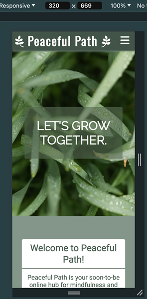

# **Peaceful Path**
Link to the deployed project: 
https://maevecrossan.github.io/peaceful-path/

## **Introduction**

Peaceful Path is a mindfulness website targeted towards those either starting or restarting their mindfulness journey. Its main purpose is to establish a relationship with its audience, promote its brand identity while finalising its services, provide essential information on mindfulness, and offer free a 30-day mindfulness guide.

## **UX**

### Target Audiences
* Students, young professionals and working adults who would like to reduce stress levels and seek work-life balance. 
* Parents/ carers who would like to make more time for themselves and reduce stress. 
* Middle-aged and seniors who are facing a combination of career demands, family responsibilities, and potential health concerns, making mindfulness appealing for its holistic health benefits.
* Mindfulness techniques and culture is found globally, meaning the value of mindfulness is acknowledged widely and appeals to an expansive audience.

### User Stories
As a user...
* I want to learn more about the company.
* I want to learn about mindfulness and its benefits.
* I want to experience how this brand views mindfulness.
* I want the choice to be updated on future services that will become available. 
* I want to experience how the company teaches mindfulness through various media.

As a business...
* I want to establish a relationship with my audience.
* I want to promote my brand identity and ethos.
* I want to show an active interest in mindfulness by improving and growing our services.
* I want users to engage with the 30-day mindfulness challenge.
* I want to grow our customer base by encouraging users to sign up for updates.
* I want to create a small gallery of original content to further engage customers and display our services.

#### Opportunities
Below is a table of opportunities based off user stories with corresponding importance and viability/feasibility ratings. 

| Opportunities | Importance | Viability/Feasibility |
|-----|:-----:|:-----:|
| Learn more about the company | 5 | 5 |
| Learn about mindfulness and its benefits | 5 | 5 |
| Experience how this brand views mindfulness | 4 | 5 |
| Choice to be updated on future services | 3 | 5 |
| Experience how the company teaches mindfulness through various media | 3 | 1 |

I decided to omit the last opportunity as I knew more time would be needed to learn how to create a gallery through which to display images, videos and audio. My main concern was making the display of the media match the rest of the website in terms of cleanliness and simplicity. I decided it was not a priority for this project, but would certainly be something I would have liked to have added, had there been enough time to learn, practice and execute it.

### Wireframe Mockups
I used the app Procreate on my iPad to draw and map out the basic structure of each page. I opted to use this app as I am very familiar with it, gives me complete creative freedom, and allows me to make adjustments very easily.

*Figure 1 - Mobile Outline: index.html & explanation.html*

*Figure 2 - Mobile Outline: signup.html & form-feedback.html*

*Figure 3 - Screens 768px and Above Outline: homepage*

>:memo: Note: Only this much of the larger screen mockup is drawn as the rest of the elements remain the same regardless of screensize

## Features

### Common Features
#### Colour Palette
I used Procreate to create my colour scheme by pulling colours from the hero image. This helped me create a rough colour palette which I used until the project was about 80% done. The original colours were modified towards the end of the project to improve accessibility.
The colours I used are as follows:

| Colour Names | Use |
|-----|:-----:|
| rgb (66, 84, 72) or #425448 | header and footer background |
| rgb (255, 255, 255) or #ffffff | header font, the footer font and the (alternating) body text/div backgrounds |
| rgb (110, 127, 115) or #6E7F73 | menu box-shadow |
| rgb (131, 150, 137) or #839689 | main background |
| rgb (85, 105, 91) or #55695B | (alternating) body text/div background |

#### The Logo

The logo remains in the top left corner of the header at all times, adjusting size depending on the screen size. I added the branch decorations from Font Awesome to give the help the logo stand out, to add visual interest, to add some space to the text, and to further emphasise the natural theme.

The logo also acts as a clickable link to the homepage. I added this feature, despite having a link to the homepage in the navigation, as it is an expected UX feature. I do appreciate that one renders the other redundant, but I felt as though the home link in the navigation was important as it indicates where the user is on the site.

#### Navigation

The above navigation bar is seen on screens above 768px. It features three links displayed horizontally below the logo. The first link brings the user to the homepage, the second to an explanation page (_What is Mindfulness?_), and the third to a signup page (_Getting Started_). The links will be marked active with a white line under the relevant name.

On screens smaller than 768px, the menu will drop down once the burger icon in the top right is tapped, vertically displaying the same three links mentioned above.
Both menus feature a box shadow to separate it from the rest of the content.

#### Footer

The footer sticks to the bottom of each page and houses four icons, each linking to a different social media site. These links only link to the homepage of the networks as Peaceful Path has no account on these sites. The links will open in new tabs. The styling of the footer matches that of the header for consistency. 

#### Page Breakers

I added a small lotus flower icon between the sections on each page to break up the text. I felt it was important to give some breathing room as there is a large amount of text on each page. 
I chose this icon because of its popularity in the world of wellness.

#### Typography

I used a total of three fonts for this project, each imported from Google Fonts. The fonts used were:

| Font Names | Use |
|-----|:-----:|
| Oswald | Logo/title |
| Raleway | Slogan |
| Roboto | Body Text |

#### Centred Content

Each block of content in this project lives in the centre of each page. I made this choice because I wanted the layout to remain consistent regardless of what device the user was using. 

I also didn’t want to space elements too far apart and create awkward gaps that needed filling. I wanted to maintain a simplistic yet distinct appearance. I have included screenshots fo the content below.

                  

