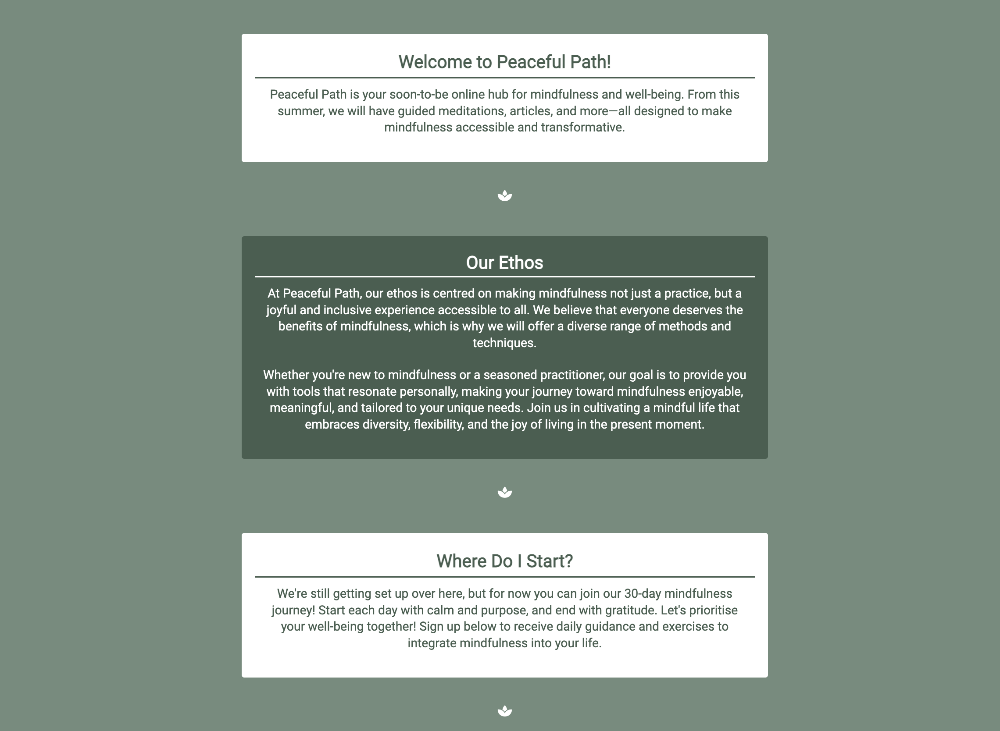
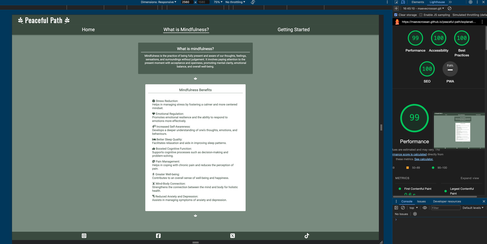
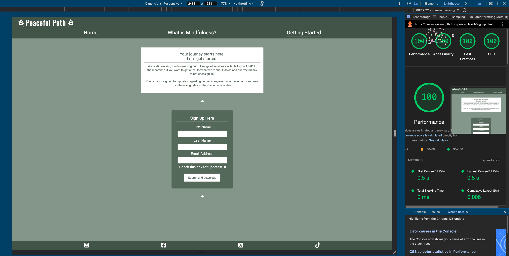
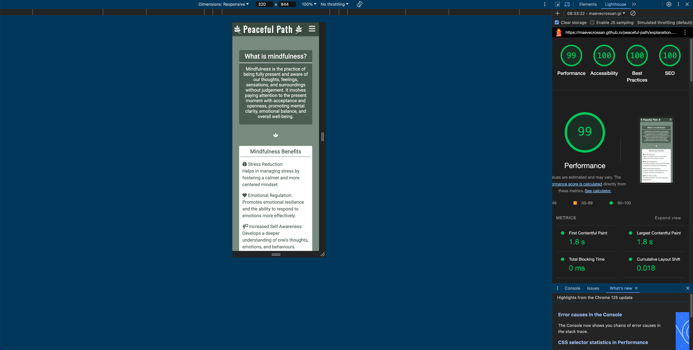

# **Peaceful Path**
Link to the deployed project: 
https://maevecrossan.github.io/peaceful-path/

## **Introduction**

Peaceful Path is a mindfulness website targeted towards those either starting or restarting their mindfulness journey. Its main purpose is to establish a relationship with its audience, promote its brand identity while finalising its services, provide essential information on mindfulness, and offer free a 30-day mindfulness guide. 

This project was built with HTML and CSS.

## **UX**

### Target Audiences
* Students, young professionals and working adults who would like to reduce stress levels and seek work-life balance. 
* Parents/ carers who would like to make more time for themselves and reduce stress. 
* Middle-aged and seniors who are facing a combination of career demands, family responsibilities, and potential health concerns, making mindfulness appealing for its holistic health benefits.
* Mindfulness techniques and culture is found globally, meaning the value of mindfulness is acknowledged widely and appeals to an expansive audience.

### User Stories
As a user...
* I want to learn more about the company.
* I want to learn about mindfulness and its benefits.
* I want to experience how this brand views mindfulness.
* I want the choice to be updated on future services that will become available. 
* I want to experience how the company teaches mindfulness through various media.

As a business...
* I want to establish a relationship with my audience.
* I want to promote my brand identity and ethos.
* I want to show an active interest in mindfulness by improving and growing our services.
* I want users to engage with the 30-day mindfulness challenge.
* I want to grow our customer base by encouraging users to sign up for updates.
* I want to create a small gallery of original content to further engage customers and display our services.

#### Opportunities
Below is a table of opportunities based off user stories with corresponding importance and viability/feasibility ratings. 

| Opportunities | Importance | Viability/Feasibility |
|-----|:-----:|:-----:|
| Learn more about the company | 5 | 5 |
| Learn about mindfulness and its benefits | 5 | 5 |
| Experience how this brand views mindfulness | 4 | 5 |
| Choice to be updated on future services | 3 | 5 |
| Experience how the company teaches mindfulness through various media | 3 | 1 |

I decided to omit the last opportunity as I knew more time would be needed to learn how to create a gallery through which to display images, videos and audio. My main concern was making the display of the media match the rest of the website in terms of cleanliness and simplicity. I decided it was not a priority for this project, but would certainly be something I would have liked to have added, had there been enough time to learn, practice and execute it.

### Wireframe Mockups
I used the app Procreate on my iPad to draw and map out the basic structure of each page. I opted to use this app as I am very familiar with it, gives me complete creative freedom, and allows me to make adjustments very easily.

*Figure 1 - Mobile Outline: index.html & explanation.html*

*Figure 2 - Mobile Outline: signup.html & form-feedback.html*

*Figure 3 - Screens 768px and Above Outline: homepage*

>:memo: Note: Only this much of the larger screen mockup is drawn as the rest of the elements remain the same regardless of screensize

## Features

### Common Features
#### Colour Palette
I used Procreate to create my colour scheme by pulling colours from the hero image. This helped me create a rough colour palette which I used until the project was about 80% done. The original colours were modified towards the end of the project to improve accessibility.
The colours I used are as follows:

| Colour Names | Use |
|-----|:-----:|
| rgb (66, 84, 72) or #425448 | header and footer background |
| rgb (255, 255, 255) or #ffffff | header font, the footer font and the (alternating) body text/div backgrounds |
| rgb (110, 127, 115) or #6E7F73 | menu box-shadow |
| rgb (131, 150, 137) or #839689 | main background |
| rgb (85, 105, 91) or #55695B | (alternating) body text/div background |

#### The Logo

The logo remains in the top left corner of the header at all times, adjusting size depending on the screen size. I added the branch decorations from Font Awesome to give the help the logo stand out, to add visual interest, to add some space to the text, and to further emphasise the natural theme.

The logo also acts as a clickable link to the homepage. I added this feature, despite having a link to the homepage in the navigation, as it is an expected UX feature. I do appreciate that one renders the other redundant, but I felt as though the home link in the navigation was important as it indicates where the user is on the site.

#### Navigation

The above navigation bar is seen on screens above 768px. It features three links displayed horizontally below the logo. The first link brings the user to the homepage, the second to an explanation page (_What is Mindfulness?_), and the third to a signup page (_Getting Started_). The links will be marked active with a white line under the relevant name.

On screens smaller than 768px, the menu will drop down once the burger icon in the top right is tapped, vertically displaying the same three links mentioned above.
Both menus feature a box shadow to separate it from the rest of the content.

#### Footer

The footer sticks to the bottom of each page and houses four icons, each linking to a different social media site. These links only link to the homepage of the networks as Peaceful Path has no account on these sites. The links will open in new tabs. The styling of the footer matches that of the header for consistency. 

#### Page Breakers

I added a small lotus flower icon between the sections on each page to break up the text. I felt it was important to give some breathing room as there is a large amount of text on each page. 
I chose this icon because of its popularity in the world of wellness.

#### Typography

I used a total of three fonts for this project, each imported from Google Fonts. The fonts used were:

| Font Names | Use |
|-----|:-----:|
| Oswald | Logo/title |
| Raleway | Slogan |
| Roboto | Body Text |

#### Centred Content

Each block of content in this project lives in the centre of each page. I made this choice because I wanted the layout to remain consistent regardless of what device the user was using. 

I also didn’t want to space elements too far apart and create awkward gaps that needed filling. I wanted to maintain a simplistic yet distinct appearance. I have included screenshots fo the content below.

&nbsp;&nbsp;&nbsp;&nbsp;&nbsp;&nbsp;&nbsp;&nbsp;&nbsp;&nbsp;&nbsp;&nbsp;&nbsp;&nbsp;&nbsp;&nbsp;&nbsp;&nbsp;

### Page 1: The Homepage

#### The Hero Image

I used my own image for the hero at the top of the homepage. I chose it because of the array of colours it holds but also because of the mood it conveys. I wanted a picture that was calming, which encouraged the user to feel relaxed and to associate that feeling with the Peaceful Path brand.

It also acts as the inspiration for the colour scheme which in turn encourages users to link it to the brand.
The hero image also acts as a clear indicator that the user is on/has returned to the homepage, as no other page has one.

#### The Slogan

I chose to add a slogan to lay on top of the hero image. I felt this added some personality and engaged the user more so than the image alone would do.
It acts as a note of encouragement and as a challenge to the user, as well as evokes the feeling of community.

I added an opaque background of green to make it more legible and noticeable. It is also the only text in uppercase lettering, separating it from the other content.

#### The Main Section: About Us

This section is broken into the following three subsections:
* Welcome to Peaceful Path!
* Our Ethos
* Where do I start?

The sections are differentiated by colour, alternating between green-text-white-background or white-text-green-background. This is to add decoration and depth to the page, all while keeping it simplistic.

Each section is wrapped in its own box for clarity.
The heading for each subsection is underlined to separate it from the paragraph below.

The sections are further separated with the lotus flower icon. 
The content of the page remains in a column but resizes depending on the screen size. To combat excessive growth on very large screens, a max width was set to facilitate a more enjoyable reading experience. 

As previously mentioned, I decided to omit additional images and decoration as I wanted to keep the focus on the text and prevent cognitive overload.

### Page 2: What is Mindfulness?

Page two is broken into two subsections:
* What is mindfulness?
* Mindfulness Benefits

The purpose of this page is to efficiently deliver essential information to the user. 

The sections have different widths to add some visual dynamics, and to ensure the list is quick and easy to read.
I chose to display the benefits in an unordered list and marked each point with an icon to separate the text while keeping it concise. I feel as though the icons add a touch of personality and visual interest. 

As seen on the homepage, the sections are separated by the lotus icons. The content of the page also remains in a column and resizes depending on the screen size. 

### Page 3: Getting Started

This page encourages the user to download the 30-day mindfulness guide and to sign up for updates if they so wish.
The form is just a mock form and uses the GET method.

Each section of the form is required except for the checkbox.
Filling out the form and submitting it will bring the user to a fourth page.

Similarly to the first two pages, content of this page will also remain in a column and will resize depending on the screen size. It is also kept intentionally simplistic as I wanted the form to be the main focus.

### Page 4: Form Feedback

The form feedback page includes a thank you message and a clickable link. The link will initiate the immediate download on the 30-day guide to the user’s device. 

To prevent the user from needing to use the forward/back arrows the browser provides, a ‘Return to Homepage’ button was added above the footer.

No unnecessary clutter was added so that the user knows that all actions on the page have been completed. The feedback message will resize depending on the device depending on the screen size.

## Testing

I tested my project throughout development. I have divided my testing into two sections below: developmental testing and post developmental testing.

### Developmental Testing

I conducted testing throughout all stages of development. My initial testing was done using Chrome devtools to make sure my HTML content was showing up correctly. 

Once I confirmed my content was being displayed, I took the mobile-first approach. I designed my website for mobiles first, only moving onto larger screens when I was 80% completed with the mobile design.

I then progressed through the screen sizes and added to the CSS accordingly, making sure the content remained accessible and responsive through media queries.  

Testing was done across multiple devices, but primarily:
* Macbook Pro: 2880px x 1800px
* BenQ EL2870U Display: 3840px x 2160px
* iPad Pro: 2732px x 2048px
* iPad 14 Pro Max: 2796px x 1290px

I used four different browsers and their devtools on the above devices to view and test my website:
* Chrome
* Safari
* Firefox
* Microsoft Edge

I also sent the deployed website to friends and family to test it, each with varying experience with technology and web development. 

### Post Developmental Testing

#### Validator Testing

##### W3C Validator

HTML

No errors were found when checked with the W3C Validator.

Page 1: Homepage (index.html)
https://validator.w3.org/nu/?showsource=yes&doc=https%3A%2F%2Fmaevecrossan.github.io%2Fpeaceful-path%2Findex.html

Page 2: What is Mindfulness? (explanation.html)
https://validator.w3.org/nu/?showsource=yes&doc=https%3A%2F%2Fmaevecrossan.github.io%2Fpeaceful-path%2Fexplanation.html

Page 3: Getting Started (signup.html)

https://validator.w3.org/nu/?showsource=yes&doc=https%3A%2F%2Fmaevecrossan.github.io%2Fpeaceful-path%2Fsignup.html

Page 4: Form Feedback (form-feedback.html)

https://validator.w3.org/nu/?showsource=yes&doc=https%3A%2F%2Fmaevecrossan.github.io%2Fpeaceful-path%2Fform-feedback.html%3Ffirst-name%3DJane%26last-name%3DDoe%26email-address%3Djanedoe%2540gmail.com

CSS
No errors were found when checked with the W3C CSS validator.

https://jigsaw.w3.org/css-validator/validator?uri=https%3A%2F%2Fmaevecrossan.github.io%2Fpeaceful-path%2Findex.html&profile=css3svg&usermedium=all&warning=1&vextwarning=&lang=en

##### Contrast Grid
I used the contrast grid to enure by colour combinations would allow for an accessible experience. 

As previously mentioned, the grid revealed that two of my original colours were not suitable. Below shows the final colours used for the project. All used combinations received an AA or AAA rating. 

##### Lighthouse
I used Lighthouse in devtools to test my website on both mobiles and desktop.
Below is the results for desktop:

Below are the Lighthouse results for mobile:

##### WAVE Evaluation Tool
I also used WAVE to test my accessibility. There were a couple of things flagged by wave, each of which is discussed above the relevant screenshot where necessary.

As previously mentioned, the logo links to the homepage, therefore WAVE has marked the home link in the navigation redundant. This alert is found on each page, but I chose to include both links regardless.

Page 1: The Homepage

As previously mentioned, the logo links to the homepage, therefore WAVE has marked the home link in the navigation redundant. This alert is found on each page, but I chose to include both links regardless.

Page 2: What is Mindfulness?

Page 3: Getting Started

Page 4: Form Feedback

WAVE shows three alerts for this page.
1. Home page link.
2. It suggests making the second paragraph in the message a heading, but I feel that it should not be one, nor does it hold the appearance of a heading.
3. It alerts to a PDF file being present and wants to make sure it is an accessible document. I have chosen to ignore this alert as it is just a placeholder document used to facilitate the downloading process. 

